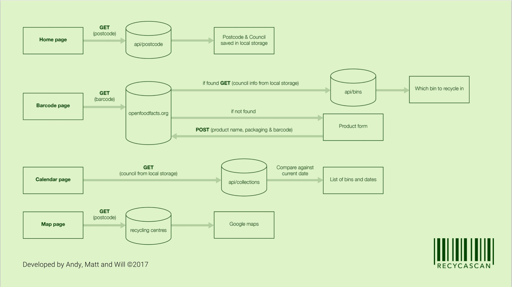

# Recycascan

- Hello welcome to Will, Matt and Andys React Native mobile app - Recycascan! This app was the final project during Northcoders full stack web development course. The app was built with React Native and is currently compatible with android mobile operating systems.

- This repository is the backend API for our app see below for installation details.

# Recycascan features
- Recycascan can with the users postcode, scan food packaging barcodes and tell the user which recycling waste bin to put the packaging in. Recycascan can differentiate between different councils' requirements for different packaging to be put into different colour bins. The app also has a calendar which shows which bins will be collected on a particular day also depending on the users local council collections. Lastly there is a map which shows all the main recycling centres local to the users postcode location.

# Demonstration

Please click the link for a brief video of the app

- [Recycascan](https://www.youtube.com/watch?v=IUdKmzv3k6M)

# Prerequisites

To run this project you will need node.js and mongodb installed locally.

# Installation of API

- Clone the repository 
``` 
git clone https://github.com/mj-e/recycascan-api.git
```

- Install dependencies 
``` 
npm install
```

- To seed the database
```
npm run seed
```

- To run the test environment 
```
npm test
```

# Download 

An apk version of the app can be downloaded from here to install on android devices - 

- [Download](https://recycascan.herokuapp.com/)

# App architecture



## Built With

* [MongoDB](https://www.mongodb.com/) 
* [Express](https://expressjs.com/) 
* [Mongoose](http://mongoosejs.com/) 
* [mLab](https://mlab.com/home) 
* [Heroku](https://www.heroku.com/) 
* [Async JS](http://caolan.github.io/async/)